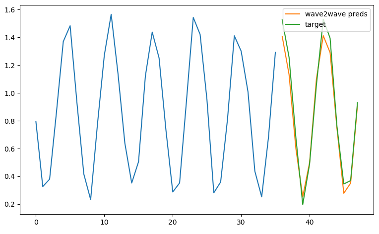

# DeepSeries
Deep Learning Models for time series prediction.

## Models

- [x] Seq2Seq / Attention
- [x] WaveNet
- [ ] Bert / Transformer

## Quick Start

```python
from deepseries.models import Wave2Wave, RNN2RNN
from deepseries.train import Learner
from deepseries.data import Value, create_seq2seq_data_loader, forward_split
from deepseries.nn import RMSE, MSE
import deepseries.functional as F
import numpy as np
import torch

batch_size = 16
enc_len = 36
dec_len = 12
series_len = 1000

epoch = 100
lr = 0.001

valid_size = 12
test_size = 12

series = np.sin(np.arange(0, series_len)) + np.random.normal(0, 0.1, series_len) + np.log2(np.arange(1, series_len+1))
series = series.reshape(1, 1, -1)

train_idx, valid_idx = forward_split(np.arange(series_len), enc_len=enc_len, valid_size=valid_size+test_size)
valid_idx, test_idx = forward_split(valid_idx, enc_len, test_size)

# mask test, will not be used for calculating mean/std.
mask = np.zeros_like(series).astype(bool)
mask[:, :, test_idx] = False
series, mu, std = F.normalize(series, axis=2, fillna=True, mask=mask)

# create train/valid dataset
train_dl = create_seq2seq_data_loader(series[:, :, train_idx], enc_len, dec_len, sampling_rate=0.1,
                                      batch_size=batch_size, seq_last=True, device='cuda')
valid_dl = create_seq2seq_data_loader(series[:, :, valid_idx], enc_len, dec_len,
                                      batch_size=batch_size, seq_last=True, device='cuda')

# define model
wave = Wave2Wave(target_size=1, num_layers=6, num_blocks=1, dropout=0.1, loss_fn=RMSE())
wave.cuda()
opt = torch.optim.Adam(wave.parameters(), lr=lr)

# train model
wave_learner = Learner(wave, opt, root_dir="./wave", )
wave_learner.fit(max_epochs=epoch, train_dl=train_dl, valid_dl=valid_dl, early_stopping=True, patient=16)

# load best model
wave_learner.load(wave_learner.best_epoch)

# predict and show result
import matplotlib.pyplot as plt
wave_preds = wave_learner.model.predict(torch.tensor(series[:, :, test_idx[:-12]]).float().cuda(), 12).cpu().numpy().reshape(-1)

plt.plot(series[:, :, -48:-12].reshape(-1))
plt.plot(np.arange(36, 48), wave_preds, label="wave2wave preds")
plt.plot(np.arange(36, 48), series[:, :, test_idx[-12:]].reshape(-1), label="target")
plt.legend()
```




**More examples will be update in example folder soon.**


## Performence


I will test model performence in Kaggle or other data science competition. It will comming soon.


## Install

```shell
git clone https://github.com/EvilPsyCHo/Deep-Time-Series-Prediction.git
cd Deep-Time-Series-Prediction
python setup.py install
```


## Refs

- [WaveNet Keras Toturial: TimeSeries_Seq2Seq](https://github.com/JEddy92/TimeSeries_Seq2Seq)
- [WaveNet Kaggle Web Traffic Forcasting Competition RANK 6](https://github.com/sjvasquez/web-traffic-forecasting)
- [Seq2Seq Kaggle Web Traffic Forcasting Competition RANK 1](https://www.kaggle.com/c/web-traffic-time-series-forecasting/discussion/43795#latest-631996)
- [Kaggle: Corporación Favorita Grocery Sales Forecasting Top1 LSTM/LGBM](https://www.kaggle.com/c/favorita-grocery-sales-forecasting/discussion/47582)
- [Kaggle: Corporación Favorita Grocery Sales Forecasting Top5 LGBM/CNN/Seq2Seq](https://www.kaggle.com/c/favorita-grocery-sales-forecasting/discussion/47556)
- [Temporal Pattern Attention for Multivariate Time Series Forecasting, 2018](https://arxiv.org/abs/1809.04206)
- BahdanauAttention: NEURAL MACHINE TRANSLATION BY JOINTLY LEARNING TO ALIGN AND TRANSLATE
- Effective Approaches to Attention-based Neural Machine Translation
- BahdanauAttention and LuongAttention